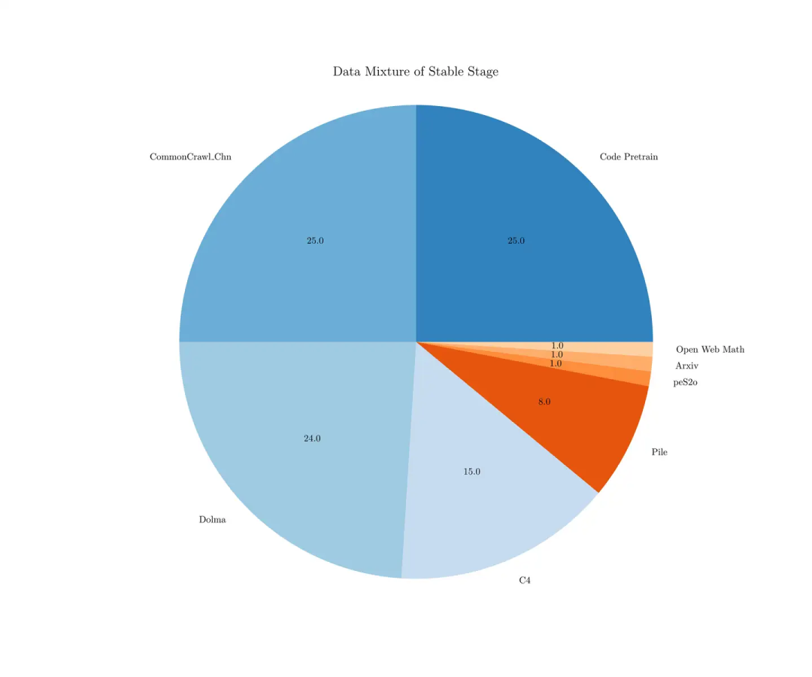

<div align="center">
<a href="https://github.com/mqqq333/LorewormGu" target="blank">

</a>

<h2> LorewormGu: From 0 to 1 on Large Language Models </h2>

  





</div>

## 💡 Overview

**"人是万物之灵，蛊是天地真精"**

**LorewormGu** is a large-scale pre-trained language model project, built from scratch with tens of millions of parameters. It encompasses three key stages: **Pretraining, Supervised Fine-Tuning (SFT), and R1 Distillation Fine-Tuning.** The core goal of the project is to create an **efficient, reasoning-capable question-answering system** through innovative model architecture and optimized training processes.
Much like the **Bookworm Gu from Gu Zhen Ren (a popular novel)**, which possesses the ability to record and store knowledge, LorewormGu is designed to effectively accumulate and process vast amounts of information. This allows the system to efficiently retrieve and reason about data, making it a powerful tool for various intelligent applications.
Through meticulous training and fine-tuning, LorewormGu demonstrates the ability to handle complex multi-task learning, making it suitable for a wide range of AI applications, such as intelligent customer support, automated reasoning, and text generation.

## ✨ Features

- **🧠 Advanced Architecture**: Built with **LLaMA3-inspired** architecture, featuring **RMSNorm**, **grouped attention**, **SwiGLU activation**, and **RoPE positional encoding** for enhanced performance.
- **💡 Optimized Tokenizer**: Custom-built **BBPE tokenizer**, optimized for **Chinese language processing**, ensuring fast and efficient decoding.
- **⚙️ Large-Scale Pretraining**: Pretrained on **JiangShu dataset** with **mixed-precision training** for improved efficiency and stability.
- **🧑‍🏫 Supervised Fine-Tuning (SFT)**: Enhanced **instruction-following** and **task execution** capabilities through fine-tuning on open-source SFT datasets.
- **🔬 R1 Distillation Fine-Tuning**: Applied **Deepseek-R1 distillation** to improve **slow thinking** and reasoning capabilities.
- **⚡ Multi-Task Learning**: Supports **multi-task learning**, excelling at tasks like **question answering**, **text generation**, and **translation**.
- **🔍 Enhanced Language Understanding**: Optimized for a wide range of **NLP tasks** including **sentiment analysis** and **summarization**.

Whether you're an aspiring AI researcher or a seasoned professional, **LorewormGu** is the perfect project for diving into cutting-edge model design and training methods. 🌟 You can learn both the theoretical foundations and practical applications of large-scale models, providing a solid foundation for further academic research in the AI field.

## 👩‍💻 Tech Stack

- **PyTorch**: Leading deep learning frameworks for building and training large-scale models.
- **Hugging Face Transformers**: A powerful library for natural language processing, providing pre-trained models and tools to fine-tune them.
- **Deepseek-R1**: A distillation technique to optimize and improve the reasoning capabilities of models.
- **BBPE Tokenizer**: Custom-designed tokenizer based on Byte Pair Encoding, optimized for efficient language processing.
- **NVIDIA CUDA**: GPU-accelerated library for training large models efficiently.
- **Mixed-Precision Training**: A technique for improving training efficiency by using both 16-bit and 32-bit floating-point numbers.
- **Wandb**: A platform for experiment tracking, model monitoring, and collaboration, enabling real-time visualization of training progress.
## 📖 Sources and external API's

- **[Hugging Face](https://huggingface.co)**: A platform for accessing pre-trained models, datasets, and tools for natural language processing tasks. We leverage Hugging Face's large model library for fine-tuning and training our models.
- **[OpenAI](https://openai.com)**: Provides state-of-the-art language models and research papers that help in developing and enhancing large language models like **LorewormGu**.
- **[Wandb](https://www.wandb.com)**: We use **Weights and Biases** to track experiments, visualize metrics, and collaborate on model performance during training.
- **[Google Cloud](https://cloud.google.com)**: Utilized for training infrastructure, providing powerful cloud computing resources like GPUs and TPUs for efficient model training and deployment.
- **[ArXiv](https://arxiv.org)**: An open-access repository of academic papers in machine learning and artificial intelligence, offering important research and papers that guide the development of **LorewormGu**.

## 📦 Getting Started

To get a local copy of **LorewormGu** up and running, follow these steps.

### 🚀 Prerequisites

- **Python** (v3.8 or higher) and **pip** (or **conda** for package management).
- **PyTorch** or **TensorFlow** (depending on your preferred framework).
- **CUDA** (for GPU acceleration, recommended for faster model training).

## 🛠️ Installation

1. **Clone the repository:**
   ```bash
	git clone https://github.com/mqqq333/LorewormGu.git
	cd LorewormGu
   ```
2. **Install necessary libraries**
   ```bash
	pip install 
   ```
3. **Start training**
   ```bash
	python train.py
   ```
4. **Run inference**
   ```bash
	python eval_model.py
   ```
## 🤝 Contributing

We welcome contributions to **LorewormGu**! If you'd like to contribute, please follow the steps below:
1. **Fork the repository.**
2. **Create a new branch** (`git checkout -b feature/your-feature-name`).
3. **Make your changes** and commit them (`git commit -m 'Add some feature'`).
4. **Push to the branch** (`git push origin feature/your-feature-name`).
5. **Open a pull request**.

Please make sure to update tests as appropriate.

## 🐛 Issues

If you encounter any issues while using or setting up the project, please check the [Issues]() section to see if it has already been reported. If not, feel free to open a new issue detailing the problem.

When reporting an issue, please include:

- A clear and descriptive title.
- A detailed description of the problem.
- Steps to reproduce the issue.
- Any relevant logs or screenshots.
- The environment in which the issue occurs (OS, browser, Python version, etc.).

## 📜 License

Distributed under the MIT License. See [License](/LICENSE) for more information.